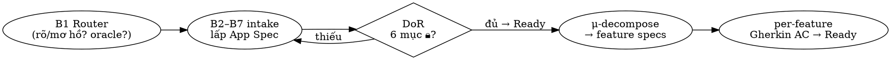

# /make-app — recipe cửa vào build DỰ ÁN mới

Biến đầu vào bất kỳ (ý tưởng · doc · clone oracle) thành **App Spec đạt Definition of
Ready**, rồi **μ-decompose** thành các **Feature Spec** đều Ready — sẵn sàng build.

- **Lab root** (resolve `contracts/`, `knowledge/` theo đây, KHÔNG theo cwd):
  `/home/tuanhoang-pc/GolandProjects/harness-lab`. Output (app spec, code) ghi vào **project hiện tại**.
- Nguồn chân lý loại spec: `knowledge/glossary.md` · Template: `contracts/` · Nguyên lý: `knowledge/principles.md`.
- Nếu user muốn THÊM 1 feature vào app có sẵn → dùng `/make-feature` (bỏ qua decompose).

## Nguyên tắc bất di (đọc trước khi chạy)
- **Từng bước, CHỜ user "gật"** rồi mới sang bước kế. KHÔNG đổ cả spec một lượt.
- **Extract** (đầu vào rõ/có oracle): tự soạn nháp, user chỉ gật/sửa. **Brainstorm**
  (đầu vào mơ hồ): hỏi sâu cho đủ trước khi soạn.
- **CÁCH HỎI:** mọi câu chốt dùng tool **AskUserQuestion** — 2–4 option; mỗi option có
  `description` nêu trade-off; option nên chọn để đầu kèm "(Recommended)" và `description`
  **phải nói RÕ VÌ SAO** (không chỉ dán chữ); luôn cho nhập tự do. KHÔNG hỏi trống văn xuôi.
- **Cổng DoR bắt buộc**: thiếu bất kỳ mục 🔒 → KHÔNG sang decompose/build.
- **App Spec = WHAT/WHY**; tech stack/data/flow thuộc **Design Doc** (HOW), tách riêng.
- **Bằng chứng**: làm trong `experiments/<slug>/`, cập nhật `PLAN.md`.

## Quy trình

### B1 — Router
Hỏi/suy ra: (1) đầu vào **RÕ hay MƠ HỒ** → chọn extract vs brainstorm; (2) có **oracle/doc**
nào để extract. Tạo `experiments/<slug>/app-spec.md` từ `contracts/app-spec.template.md`,
khóa §0 metadata (id, oracle, luồng, link design-doc).

### B2–B7 — Intake lấp App Spec (mỗi mục: nháp → user gật/sửa → ghi + tick DoR)
| Bước | Mục App Spec | Chuẩn |
|------|--------------|-------|
| B2 | §1 Bối cảnh + §2 Mục tiêu & success metric | Working Backwards · SMART |
| B3 | §3 Definition of Done | đo được |
| B4 | §4 Phạm vi | MoSCoW (có Won't) |
| B5 | §5 Ràng buộc/Giả định/Phụ thuộc | — |
| B6 | §6 Phân rã Epic→User Stories | Agile (đầu vào decompose) |
| B7 | §7 Rủi ro & câu hỏi mở | (không chặn gate) |

### Gate — Definition of Ready
Đủ 6 mục 🔒 (§1–§6) → lật App Spec **Ready**. Thiếu → quay lại hỏi. Tạo `design-doc.md`
stub từ `contracts/design-doc.template.md` (link 2 chiều với app-spec).

### μ-decompose
Mỗi dòng §6 → một file `feature-specs/<fx-slug>.md` từ `contracts/feature-spec.template.md`:
điền §1 User Story, traceability (↑Epic, →design-doc), phụ thuộc, oracle. Trạng thái Draft.

### Per-feature (intake-feature, theo thứ tự phụ thuộc)
Với mỗi feature: extract **Gherkin AC** (§2, gồm nhánh lỗi/bảo mật) + ước lượng → user
gật → tick DoR → Feature Spec **Ready**.

## Output
`app-spec.md` (Ready) · `design-doc.md` (stub) · `feature-specs/*.md` (đều Ready) ·
cập nhật `experiments/<slug>/README.md` + `PLAN.md`.

## Sai lầm thường gặp
- Đổ cả spec một lượt, bỏ checkpoint → user mất kiểm soát.
- Nhảy decompose khi App Spec chưa đủ DoR.
- Nhét tech stack/data/flow vào App Spec (phải ở Design Doc).
- Quên link traceability ngược Epic ở feature spec.
- Feature spec coi là Ready khi còn thiếu Acceptance Criteria.

## Liên quan
`/make` (cửa vào hỏi app/feature) · `/make-feature` · principles nguyên lý 6 (micro-harness, recipe).
