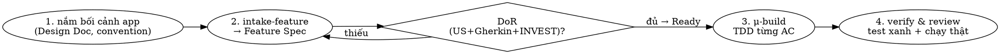

# /make-feature — recipe thêm MỘT feature vào app có sẵn

Biến một yêu cầu feature thành **Feature Spec đạt Definition of Ready**, rồi **build bằng
TDD** vào app hiện có. Bỏ qua decompose (app đã tồn tại) — đây là đường "warm".

- **Lab root** (resolve `contracts/`, `knowledge/` theo đây, KHÔNG theo cwd):
  `/home/tuanhoang-pc/GolandProjects/harness-lab`. Output (feature spec, code) ghi vào **project hiện tại**.
- Loại spec: `knowledge/glossary.md` · Template: `contracts/feature-spec.template.md` · Nguyên lý: `knowledge/principles.md`.
- Build cả app từ đầu? → dùng `/make-app` (có App Spec + μ-decompose).

## Nguyên tắc bất di
- **Từng bước, CHỜ user "gật"** rồi mới sang bước kế. KHÔNG đổ cả spec/code một lượt.
- **Extract** (rõ/có oracle) tự soạn nháp; **Brainstorm** (mơ hồ) hỏi sâu cho đủ.
- **CÁCH HỎI:** mọi câu chốt (intake/router) dùng tool **AskUserQuestion** — đưa 2–4
  option; **MỖI option có `description` nêu trade-off ngắn**; option nên chọn để đầu kèm
  "(Recommended)" và `description` của nó **phải nói RÕ VÌ SAO recommended** (đừng chỉ dán
  chữ); luôn cho nhập tự do. KHÔNG hỏi trống văn xuôi. (Hỏi vừa đủ, không tra tấn.)
- **Cổng DoR bắt buộc** trước khi code: Feature Spec phải có User Story + Gherkin AC + đạt INVEST.
- **TDD bắt buộc** khi viết code — RED→GREEN→REFACTOR. **REQUIRED:** dùng skill `superpowers:test-driven-development`.

## Quy trình

### 1. Nắm bối cảnh app
Đọc **Design Doc** + convention app hiện có (stack, pattern, cấu trúc package). Feature mới phải khớp.

### 2. Intake-feature → Feature Spec (theo `contracts/feature-spec.template.md`)
Lấp từng mục, gật rồi đi tiếp: **User Story** (Connextra) · **Acceptance Criteria** (Gherkin
Given/When/Then, gồm nhánh lỗi/bảo mật) · phạm vi · ràng buộc · phụ thuộc · ước lượng.
→ Gate **DoR**: INVEST + mọi AC testable. Thiếu → hỏi tiếp, KHÔNG code.

### 3. μ-build — TDD từ Acceptance Criteria
Với **mỗi** AC:
- AC **verify offline được** → TDD ngay: viết test trước (RED) → code tối thiểu (GREEN) → REFACTOR.
- AC cần **external** (API/OAuth grant/runtime) → **inject dependency** (func/interface), test
  logic offline bằng mock; phần concrete để E2E, **ghi chú** rõ.
- DB → test bằng **SQLite in-memory** (GORM swappable; prod đổi driver theo Design Doc).
Ráp vào app (handler/route/wiring), chạy `go test ./...` + `go vet` phải xanh.

### 4. Verify & Review
Full test xanh · (nếu được) chạy app thật chứng minh hành vi · ghi DoD: AC nào đã pass,
AC nào còn chờ E2E.

## Output
Feature Spec (Draft→Ready→Done) · code + test (TDD) · cập nhật README/PLAN của app.

## Sai lầm thường gặp
- **Code trước test** (vi phạm TDD) → xóa, làm lại từ test.
- Coi Feature Spec Ready khi **thiếu Gherkin AC**.
- Gọi thẳng external trong logic → không test offline được; **phải inject**.
- Đổ cả spec/code một lượt, bỏ checkpoint.
- Feature **lệch convention** app (đọc Design Doc trước khi code).

## Liên quan
`/make` (cửa vào hỏi app/feature) · `/make-app` (build cả app) · `superpowers:test-driven-development` · `contracts/feature-spec.template.md`.
