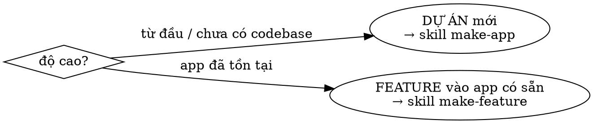

# /make — cửa vào harness (router)

Một lệnh duy nhất để bắt đầu. Hỏi **tối thiểu** để xác định *độ cao*, rồi dispatch sang
recipe đúng — user không phải nhớ chọn recipe nào.

> Router CHỈ định tuyến. Việc làm thật (intake, build) nằm ở recipe được gọi.
> **Lab root** (đường dẫn `knowledge/`, `contracts/` theo đây): `/home/tuanhoang-pc/GolandProjects/harness-lab`.

## Quy trình

### Bước 1 — Router (hỏi tối thiểu, hoặc suy ra từ ngữ cảnh)
> Khi cần hỏi: dùng tool **AskUserQuestion** — 2–4 option, mỗi option có `description` nêu
> trade-off; cái nên chọn kèm "(Recommended)" + `description` **nói rõ VÌ SAO**; luôn cho nhập
> tự do. KHÔNG hỏi trống dạng văn xuôi.
1. **Độ cao:** build **DỰ ÁN mới** từ đầu, hay **THÊM FEATURE** vào app có sẵn?
   - dự án / chưa có codebase → `make-app`
   - app đã tồn tại (có repo/Design Doc) → `make-feature`
2. (nếu cần) **Độ chín đầu vào:** có doc/oracle rõ (→ extract) hay mơ hồ (→ brainstorm)? — truyền tiếp cho recipe.

**Suy ra được từ ngữ cảnh thì KHÔNG hỏi lại** (vd user trỏ thẳng repo có sẵn → feature).

### Bước 2 — Dispatch
- Dự án → **REQUIRED:** dùng skill `make-app`.
- Feature → **REQUIRED:** dùng skill `make-feature`.

Truyền lại cho recipe: mô tả yêu cầu, oracle/doc, độ chín đầu vào.

## Sai lầm thường gặp
- Hỏi lại điều đã rõ trong ngữ cảnh (user đã nói "app mới" / đã trỏ repo).
- Tự làm intake/build trong `/make` — cửa vào CHỈ định tuyến.
- Hỏi quá nhiều — tối đa 1–2 câu rồi dispatch.

## Liên quan
`make-app` · `make-feature` · `knowledge/glossary.md` (loại spec) · `knowledge/principles.md` (recipe & micro-harness).
